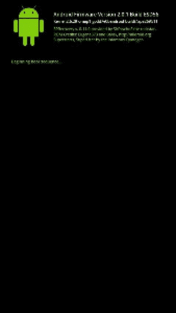
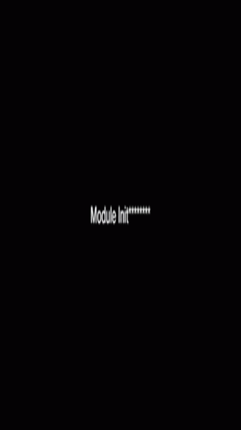

# Samsung Boot Animation Module

**Boot animation for Samsung device Magisk**

- Custom boot animations for Samsung devices via separate Magisk modules. 
- The modules replace the default boot animation with themed animations, providing a unique startup/shutdown experience.

## Requirements  
- **

- **      

- **

## Available Themes  

| Theme | Preview | Download |
|-------|---------|----------|
| **Linux** |  | [ linux-bootfx-2.0.1-magisk.zip ](https://github.com/John0n1/SMbootFX/releases/tag/2.0.1/linux-bootfx-2.0.1-magisk.zip) |
| **NetHunter** |  | [ nethunter-bootfx-2.0.1-magisk.zip ](https://github.com/John0n1/SMbootFX/releases/tag/2.0.1/nethunter-bootfx-2.0.1-magisk.zip) |
| **Superhero** |  | [ superhero-bootfx-2.0.1-magisk.zip ](https://github.com/John0n1/SMbootFX/releases/tag/2.0.1/superhero-bootfx-2.0.1-magisk.zip) |
| **EA** |  | [ ea-bootfx-2.0.1-magisk.zip ](https://github.com/John0n1/SMbootFX/releases/tag/2.0.1/ea-bootfx-2.0.1-magisk.zip) |
| **S.H.I.E.L.D** |  | [ shield-bootfx-2.0.1-magisk.zip](https://github.com/John0n1/SMbootFX/releases/tag/2.0.1/shield-bootfx-2.0.1-magisk.zip) |
| **Simpsons** |  | [ simpsons-bootfx-2.0.1-magisk.zip ](https://github.com/John0n1/SMbootFX/releases/tag/2.0.1/simpsons-bootfx-2.0.1-magisk.zip) |
| **Apple** |  | [ apple-bootfx-2.0.1-magisk.zip ](https://github.com/John0n1/SMbootFX/releases/tag/2.0.1/apple-bootfx-2.0.1-magisk.zip) |
| **CTOS** |  | [ ctos-bootfx-2.0.1-magisk.zip ](https://github.com/John0n1/SMbootFX/releases/tag/2.0.1/ctos-bootfx-2.0.1-magisk.zip) |
| **more coming soon!** ...| | | |

## **Important distinction**
The **bootloader logo** (the very first logo that appears when you power on your device) is stored in the bootloader partition and is typically **not changeable**, even with root access. This logo is hardware-level and locked down by the manufacturer.
This project specifically targets the **boot animation** that plays after the bootloader logo, during the Android system startup process.
Samsung typically uses their own proprietary .QMG or "*Quick Media Graphics*" boot animation format, which is not compatible with non-samsung devices. 
This project provides Magisk modules that replace the default boot animation with custom animations in a compatible QMG format. 
The modules also include an auto-backup feature to protect  the original samsung boot animation files in case any issues arise.

## How it works

1. Magisk hooks into the system partition and uses its late start service phase to systemlessly mount replacement boot animation files over the original ones.
2. The module will auto-backup the original samsung boot animation files in case any issues arise.

## Installation

1. **Download** your preferred boot animation
2. **Open** Magisk Manager
3. **Install** preferred module via Magisk
4. **Reboot** your device
5. **Enjoy** your new boot animation!

##  Important Notes

- Only install **one boot animation** at a time
- **Uninstall** previous animation modules before installing new ones
- Compatible with **Samsung devices only**
- **Auto-backup** feature protects your original files

- Use at your own risk.

## License

This project is licensed under the [MIT License](LICENSE).
