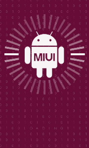
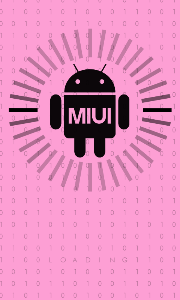
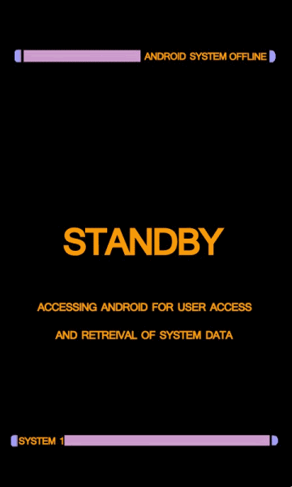

  <h1>SMbootFX - Custom Samsung Boot Animations</h1>

  
### Merry Christmas! 🎅
  

________________________________________________________________

Implements custom boot animations in `.qmg` format on Samsung devices with Magisk/KernelSU.

These modules replace the default boot animation with themed ones, offering a personalized startup and shutdown experience.

  <h3>All themes are provided as ready-to-flash Magisk modules</h3>

 

**See [Supported Devices](#supported-devices)**
________________________________________________________________

| Theme | Preview | Download |
|-------|---------|----------|
| **Android - Purple** |  | [android-bootfx-3.0.3-magisk.zip](https://github.com/John0n1/SMbootFX/releases/download/3.0.3/android-bootfx-3.0.3-magisk.zip) |  |
| **Android - Red** |  | [android-red-bootfx-3.0.3-magisk.zip](https://github.com/John0n1/SMbootFX/releases/download/3.0.3/android-red-bootfx-3.0.3-magisk.zip) |  |
| **Android Green** |  | [android-green-on-black-bootfx-3.0.3-magisk.zip](https://github.com/John0n1/SMbootFX/releases/download/3.0.3/android-green-on-black-bootfx-3.0.3-magisk.zip) |  |
| **Android White on Plum** |  | [android-white-on-plum-bootfx-3.0.3-magisk.zip](https://github.com/John0n1/SMbootFX/releases/download/3.0.3/android-white-on-plum-bootfx-3.0.3-magisk.zip) |  |
| **MIUI Blue Android on Black** |  | [miui-blue-android-on-black-bootfx-3.0.3-magisk.zip](https://github.com/John0n1/SMbootFX/releases/download/3.0.3/miui-blue-android-on-black-bootfx-3.0.3-magisk.zip) |  |
| **MIUI Black Android on Pink** |  | [miui-black-android-on-pink-bootfx-3.0.3-magisk.zip](https://github.com/John0n1/SMbootFX/releases/download/3.0.3/miui-black-android-on-pink-bootfx-3.0.3-magisk.zip) |  |
| **MIUI White Android on Black** |  | [miui-white-android-on-black-bootfx-3.0.3-magisk.zip](https://github.com/John0n1/SMbootFX/releases/download/3.0.3/miui-white-android-on-black-bootfx-3.0.3-magisk.zip) |  |
| **MIUI White Android on Blue** |  | [miui-white-android-on-blue-bootfx-3.0.3-magisk.zip](https://github.com/John0n1/SMbootFX/releases/download/3.0.3/miui-white-android-on-blue-bootfx-3.0.3-magisk.zip) |  |
| **Cyanogen Android** |  | [green-android-bootfx-3.0.3-magisk.zip](https://github.com/John0n1/SMbootFX/releases/download/3.0.3/green-android-bootfx-3.0.3-magisk.zip) |  |
| **Simple Android Black on Red** |  | [simple-android-black-on-red-bootfx-3.0.3-magisk.zip](https://github.com/John0n1/SMbootFX/releases/download/3.0.3/simple-android-black-on-red-bootfx-3.0.3-magisk.zip) |  |
| **KitKat - Classic** |  | [kitkat-bootfx-3.0.3-magisk.zip](https://github.com/John0n1/SMbootFX/releases/download/3.0.3/kitkat-bootfx-3.0.3-magisk.zip) |  |
| **AOKP** |  | [aokp-bootfx-3.0.3-magisk.zip](https://github.com/John0n1/SMbootFX/releases/download/3.0.3/aokp-bootfx-3.0.3-magisk.zip) |  |
| **AOKP Magical** |  | [aokp-magical-bootfx-3.0.3-magisk.zip](https://github.com/John0n1/SMbootFX/releases/download/3.0.3/aokp-magical-bootfx-3.0.3-magisk.zip) |  |
| **Cyanogen Dark Boot Logo** |  | [white-on-black-bootfx-3.0.3-magisk.zip](https://github.com/John0n1/SMbootFX/releases/download/3.0.3/white-on-black-bootfx-3.0.3-magisk.zip) |  |
| **Apple - Static** |  | [apple-bootfx-3.0.3-magisk.zip](https://github.com/John0n1/SMbootFX/releases/download/3.0.3/apple-bootfx-3.0.3-magisk.zip) |  |
| **Apple Electrocution** |  | [apple-electrocution-bootfx-3.0.3-magisk.zip](https://github.com/John0n1/SMbootFX/releases/download/3.0.3/apple-electrocution-bootfx-3.0.3-magisk.zip) |  |
| **Blue Lines A** |  | [blue-lines-a-bootfx-3.0.3-magisk.zip](https://github.com/John0n1/SMbootFX/releases/download/3.0.3/blue-lines-a-bootfx-3.0.3-magisk.zip) |  |
| **CTOS - Watchdogs** |  | [ctos-bootfx-3.0.3-magisk.zip](https://github.com/John0n1/SMbootFX/releases/download/3.0.3/ctos-bootfx-3.0.3-magisk.zip) |  |
| **NetHunter** |  | [nethunter-bootfx-3.0.3-magisk.zip](https://github.com/John0n1/SMbootFX/releases/download/3.0.3/nethunter-bootfx-3.0.3-magisk.zip) |  |
| **NetHunter - Glitch** |  | [nethunter-glitch-bootfx-3.0.3-magisk.zip](https://github.com/John0n1/SMbootFX/releases/download/3.0.3/nethunter-glitch-bootfx-3.0.3-magisk.zip) |  |
| **NetHunter - Burning** |  | [nethunter-burning-bootfx-3.0.3-magisk.zip](https://github.com/John0n1/SMbootFX/releases/download/3.0.3/nethunter-burning-bootfx-3.0.3-magisk.zip) |  |
| **CyanogenMod 7** |  | [cyanogen7-bootfx-3.0.3-magisk.zip](https://github.com/John0n1/SMbootFX/releases/download/3.0.3/cyanogen7-bootfx-3.0.3-magisk.zip) |  |
| **OnePlus Cyberpunk** |  | [oneplus-bootfx-3.0.3-magisk.zip](https://github.com/John0n1/SMbootFX/releases/download/3.0.3/oneplus-bootfx-3.0.3-magisk.zip) |  |
| **Pixel** |  | [pixel-bootfx-3.0.3-magisk.zip](https://github.com/John0n1/SMbootFX/releases/download/3.0.3/pixel-bootfx-3.0.3-magisk.zip) |  |
| **Windows** |  | [windows-bootfx-3.0.3-magisk.zip](https://github.com/John0n1/SMbootFX/releases/download/3.0.3/windows-bootfx-3.0.3-magisk.zip) |  |
| **Error** |  | [error-bootfx-3.0.3-magisk.zip](https://github.com/John0n1/SMbootFX/releases/download/3.0.3/error-bootfx-3.0.3-magisk.zip) |  |
| **Valorant** |  | [valorant-bootfx-3.0.3-magisk.zip](https://github.com/John0n1/SMbootFX/releases/download/3.0.3/valorant-bootfx-3.0.3-magisk.zip) |  |
| **EA Game's** |  | [ea-bootfx-3.0.3-magisk.zip](https://github.com/John0n1/SMbootFX/releases/download/3.0.3/ea-bootfx-3.0.3-magisk.zip) |  |
| **Xbox One** |  | [xbox-one-bootfx-3.0.3-magisk.zip](https://github.com/John0n1/SMbootFX/releases/download/3.0.3/xbox-one-bootfx-3.0.3-magisk.zip) |  |
| **S.H.I.E.L.D.** |  | [shield-bootfx-3.0.3-magisk.zip](https://github.com/John0n1/SMbootFX/releases/download/3.0.3/shield-bootfx-3.0.3-magisk.zip) |  |
| **Simpsons** |  | [simpsons-bootfx-3.0.3-magisk.zip](https://github.com/John0n1/SMbootFX/releases/download/3.0.3/simpsons-bootfx-3.0.3-magisk.zip) |  |
| **Linux/Android** |  | [linux-bootfx-3.0.3-magisk.zip](https://github.com/John0n1/SMbootFX/releases/download/3.0.3/linux-bootfx-3.0.3-magisk.zip) |  |
| **Marvel DC Clash** |  | [marvel-dc-clash-bootfx-3.0.3-magisk.zip](https://github.com/John0n1/SMbootFX/releases/download/3.0.3/marvel-dc-clash-bootfx-3.0.3-magisk.zip) |  |
| **Marvel Thor Dark World (Revision)** |  | [marvel-thor-dark-world-bootfx-3.0.3-magisk.zip](https://github.com/John0n1/SMbootFX/releases/download/3.0.3/marvel-thor-dark-world-bootfx-3.0.3-magisk.zip) |  |
| **Star Trek Twist (Revision)** |  | [star-trek-twist-bootfx-3.0.3-magisk.zip](https://github.com/John0n1/SMbootFX/releases/download/3.0.3/star-trek-twist-bootfx-3.0.3-magisk.zip) |  |
| *More coming soon!* |  |  |  |

## Important Distinctions

1. This project targets the **boot animation** that plays after the bootloader logo, during the Android system startup.
2. Newer Samsung devices use the `.qmg` (**Qmage**) format, which is **not compatible** with non-Samsung devices.
3. These Magisk modules provide custom animations in a compatible `.qmg` format.
4. Modules include an **auto-backup** feature to safeguard your original Samsung boot animation files.

## How It Works

1. Magisk hooks into the system partition and uses its late-start service to systemlessly overlay the replacement boot animation files.
2. The module automatically backs up the original files for easy restoration if needed.

## Installation Guide

1. **Download** your chosen boot animation module from the table above.
2. **Open** the Magisk app.
3. Go to **Modules** → **Install from storage**.
4. Select the `.zip` file and **install**.
5. **Reboot** your device.
6. **Enjoy** the new boot animation!

## Important Notes

- Install only **one boot animation module** at a time.
- **Uninstall** any previous boot animation modules before installing a new one.
- Compatible with **Samsung devices only**.
- The **auto-backup** feature protects your original files.
- Use at your own risk—always back up your device before modifying system files.

## Troubleshooting

- If the animation doesn't change, ensure Magisk is properly installed and the module is enabled.
- KernelSU Next 3.0+ requires a metamodule (e.g. `meta-overlayfs`) for modules to mount; install it in KernelSU Manager, then reinstall this module.
- For installation issues, check Magisk logs or try reinstalling the module.
- If problems persist, disable the module in Magisk and reboot to restore the original animation.

## Supported Devices

Most Samsung Galaxy devices manufactured after 2012 are supported.

Confirmed working on:

* **Galaxy S series:** S21, S22, S23, S24, S25
* **Galaxy A series:** A52, A53, A54, A55, A56
* **Galaxy Fold/Flip series**

To confirm support for your specific device, check if the following files exist in either `/system/media/` or `/vendor/media/`:

* `bootsamsung.qmg`
* `bootsamsungloop.qmg`
* `shutdown.qmg`

If these files are present, your device should be compatible.

## Contributions and Requests

Feel free to open an issue for bug reports, feature requests, or new theme suggestions.  
Pull requests are welcome for new themes or improvements!

## Credits

The .qmg files used in this project are made by various creators, and credits are given in the themes table above, if author is known.

## Notices

- This project is **not** affiliated with, sponsored, or endorsed by Samsung Electronics Co., Ltd., or any other mentioned or themed brands. All trademarks are the property of their respective owners.
- The `.qmg` files are only distributed inside the flashable ZIPs in the **Releases** section due to GitHub file size limitations.
- Be cautious when downloading forked versions—especially `.qmg` files—from unknown sources, as they may contain malware or unwanted modifications.
- All .qmg's created by **John0n1** are licensed under the [Creative Commons Attribution-NonCommercial 4.0 International (CC BY-NC 4.0)](https://creativecommons.org/licenses/by-nc/4.0/). The project’s source code is licensed under the **MIT License**.

## License

This project is licensed under the [MIT License](LICENSE).

