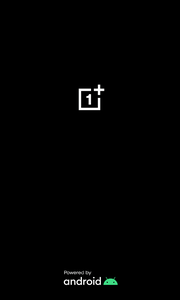
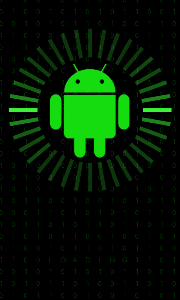
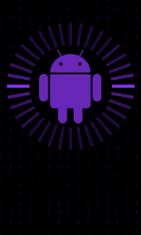
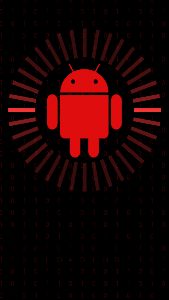
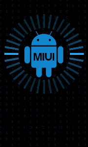
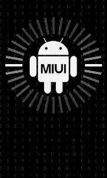
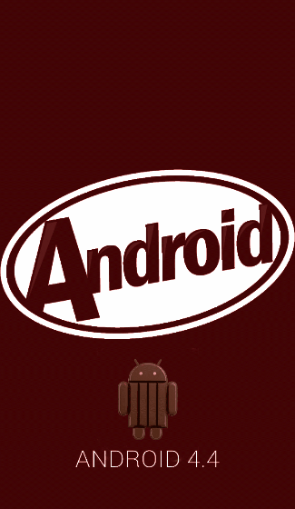
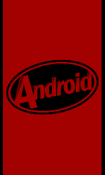
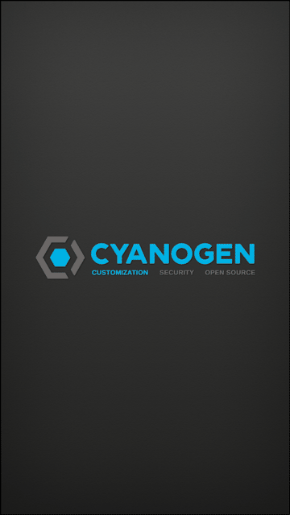
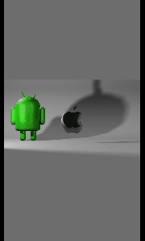

# SMbootFX - Custom Samsung Boot Animations

Implements custom boot animations in .QMG format on Samsung Galaxy devices using Magisk. These modules replace the default boot animation with themed ones, offering a personalized startup and shutdown experience.

## Requirements
- 

-  - **See [Supported Devices](#supported-devices)**

- 

## Available Themes

| Theme | Preview | Download | Made By |
|-------|---------|----------|---------|
| **OnePlus Cyberpunk** |  | [oneplus-bootfx-2.2.0-magisk.zip](https://github.com/John0n1/SMbootFX/releases/download/2.2.0/oneplus-bootfx-2.2.0-magisk.zip) | John0n1 |
| **CyanogenMod 7** |  | [cyanogen7-bootfx-2.2.0-magisk.zip](https://github.com/John0n1/SMbootFX/releases/download/2.2.0/cyanogen7-bootfx-2.2.0-magisk.zip) | John0n1 |
| **Android Green** |  | [android-green-on-black-bootfx-2.2.0-magisk.zip](https://github.com/John0n1/SMbootFX/releases/download/2.2.0/android-green-on-black-bootfx-2.2.0-magisk.zip) | **(XDA)** Melissa Pugs |
| **Android - Purple** |  | [android-bootfx-2.2.0-magisk.zip](https://github.com/John0n1/SMbootFX/releases/download/2.2.0/android-bootfx-2.2.0-magisk.zip) | **(XDA)** Melissa Pugs |
| **Android - Red** |  | [android-red-bootfx-2.2.0-magisk.zip](https://github.com/John0n1/SMbootFX/releases/download/2.2.0/android-red-bootfx-2.2.0-magisk.zip) | **(XDA)** Melissa Pugs |
| **MIUI Blue Android on Black** |  | [miui-blue-android-on-black-bootfx-2.2.0-magisk.zip](https://github.com/John0n1/SMbootFX/releases/download/2.2.0/miui-blue-android-on-black-bootfx-2.2.0-magisk.zip) | **(XDA)** Melissa Pugs |
| **MIUI White Android on Black** |  | [miui-white-android-on-black-bootfx-2.2.0-magisk.zip](https://github.com/John0n1/SMbootFX/releases/download/2.2.0/miui-white-android-on-black-bootfx-2.2.0-magisk.zip) | **(XDA)** Melissa Pugs |
| **MIUI White Android on Blue** |  | [miui-white-android-on-blue-bootfx-2.2.0-magisk.zip](https://github.com/John0n1/SMbootFX/releases/download/2.2.0/miui-white-android-on-blue-bootfx-2.2.0-magisk.zip) | **(XDA)** Melissa Pugs |
| **KitKat - Classic** |  | [kitkat-bootfx-2.2.0-magisk.zip](https://github.com/John0n1/SMbootFX/releases/download/2.2.0/kitkat-bootfx-2.2.0-magisk.zip) | Unknown |
| **Simple Android Black on Red** |  | [simple-android-black-on-red-bootfx-2.2.0-magisk.zip](https://github.com/John0n1/SMbootFX/releases/download/2.2.0/simple-android-black-on-red-bootfx-2.2.0-magisk.zip) | Unknown |
| **Cyanogen Android** |  | [green-android-bootfx-2.2.0-magisk.zip](https://github.com/John0n1/SMbootFX/releases/download/2.2.0/green-android-bootfx-2.2.0-magisk.zip) | John0n1 |
| **Cyanogen Dark Boot Logo** |  | [white-on-black-bootfx-2.2.0-magisk.zip](https://github.com/John0n1/SMbootFX/releases/download/2.2.0/white-on-black-bootfx-2.2.0-magisk.zip) | John0n1 |
| **Reactor BootAni (Revision)** |  | [reactor-bootani-revision-bootfx-2.2.0-magisk.zip](https://github.com/John0n1/SMbootFX/releases/download/2.2.0/reactor-bootani-revision-bootfx-2.2.0-magisk.zip) | John0n1 |
| **AOKP** |  | [aokp-bootfx-2.2.0-magisk.zip](https://github.com/John0n1/SMbootFX/releases/download/2.2.0/aokp-bootfx-2.2.0-magisk.zip) | **(XDA)** PartimusPrime |
| **AOKP Magical** |  | [aokp-magical-bootfx-2.2.0-magisk.zip](https://github.com/John0n1/SMbootFX/releases/download/2.2.0/aokp-magical-bootfx-2.2.0-magisk.zip) | **(XDA)** PartimusPrime |
| **NetHunter** |  | [nethunter-bootfx-2.2.0-magisk.zip](https://github.com/John0n1/SMbootFX/releases/download/2.2.0/nethunter-bootfx-2.2.0-magisk.zip) | **(kali.org)** OffSec Services |
| **CTOS - Watchdogs** |  | [ctos-bootfx-2.2.0-magisk.zip](https://github.com/John0n1/SMbootFX/releases/download/2.2.0/ctos-bootfx-2.2.0-magisk.zip) | **(kali.org)** OffSec Services |
| **Superhero** |  | [superhero-bootfx-2.2.0-magisk.zip](https://github.com/John0n1/SMbootFX/releases/download/2.2.0/superhero-bootfx-2.2.0-magisk.zip) | **(XDA)** goforce87 |
| **EA Game's** |  | [ea-bootfx-2.2.0-magisk.zip](https://github.com/John0n1/SMbootFX/releases/download/2.2.0/ea-bootfx-2.2.0-magisk.zip) | John0n1 |
| **S.H.I.E.L.D.** |  | [shield-bootfx-2.2.0-magisk.zip](https://github.com/John0n1/SMbootFX/releases/download/2.2.0/shield-bootfx-2.2.0-magisk.zip) | John0n1 |
| **Simpsons** |  | [simpsons-bootfx-2.2.0-magisk.zip](https://github.com/John0n1/SMbootFX/releases/download/2.2.0/simpsons-bootfx-2.2.0-magisk.zip) | **(XDA)** JaeKarr99 & KachowPow |
| **Pissing on Apple** |  | [pissing-on-apple-bootfx-2.2.0-magisk.zip](https://github.com/John0n1/SMbootFX/releases/download/2.2.0/pissing-on-apple-bootfx-2.2.0-magisk.zip) | John0n1 |
| **Apple - Static** |  | [apple-bootfx-2.2.0-magisk.zip](https://github.com/John0n1/SMbootFX/releases/download/2.2.0/apple-bootfx-2.2.0-magisk.zip) | John0n1 |
| **Linux/Android** |  | [linux-bootfx-2.2.0-magisk.zip](https://github.com/John0n1/SMbootFX/releases/download/2.2.0/linux-bootfx-2.2.0-magisk.zip) | John0n1 |
| **Apple Electrocution** |  | [apple-electrocution-bootfx-2.2.0-magisk.zip](https://github.com/John0n1/SMbootFX/releases/download/2.2.0/apple-electrocution-bootfx-2.2.0-magisk.zip) | John0n1 |
| **Blue Lines A** |  | [blue-lines-a-bootfx-2.2.0-magisk.zip](https://github.com/John0n1/SMbootFX/releases/download/2.2.0/blue-lines-a-bootfx-2.2.0-magisk.zip) | John0n1 |
| **Iron Man** |  | [iron-man-bootfx-2.2.0-magisk.zip](https://github.com/John0n1/SMbootFX/releases/download/2.2.0/iron-man-bootfx-2.2.0-magisk.zip) | John0n1 |
| **Marvel Avengers Sequence** |  | [marvel-avengers-sequence-bootfx-2.2.0-magisk.zip](https://github.com/John0n1/SMbootFX/releases/download/2.2.0/marvel-avengers-sequence-bootfx-2.2.0-magisk.zip) | John0n1 |
| **Xbox One** |  | [xbox-one-bootfx-2.2.0-magisk.zip](https://github.com/John0n1/SMbootFX/releases/download/2.2.0/xbox-one-bootfx-2.2.0-magisk.zip) | John0n1 |
| **Valorant** |  | [valorant-bootfx-2.2.0-magisk.zip](https://github.com/John0n1/SMbootFX/releases/download/2.2.0/valorant-bootfx-2.2.0-magisk.zip) | John0n1 |
| **More coming soon!** | | | |

## Important Distinctions

1. This project targets the **boot animation** that plays after the bootloader logo, during the Android system startup.
2. Newer Samsung devices use the .QMG ("Qmage-encoded image/animation") format, which is **not compatible** with non-Samsung devices.
3. These Magisk modules provide custom animations in a compatible .QMG format.
4. Modules include an auto-backup feature to safeguard your original Samsung boot animation files.

## How It Works

1. Magisk hooks into the system partition and uses its late-start service to systemlessly overlay the replacement boot animation files.
2. The module automatically backs up the original files for easy restoration if needed.

## Installation Guide

1. **Download** your chosen boot animation module from the table above.
2. **Open** the Magisk app.
3. **Install** the module via Magisk's "Modules" section (select "Install from storage").
4. **Reboot** your device.
5. **Enjoy** the new boot animation!

## Important Notes

- Install only **one boot animation module** at a time.
- **Uninstall** any previous boot animation modules before installing a new one.
- Compatible with **Samsung devices only**.
- The **auto-backup** feature protects your original files.
- Use at your own risk—always back up your device before modifying system files.

## Troubleshooting

- If the animation doesn't change, ensure Magisk is properly installed and the module is enabled.
- For installation issues, check Magisk logs or try reinstalling the module.
- If problems persist, disable the module in Magisk and reboot to restore the original animation.

# Supported Devices

Confirmed compatability with the following Samsung devices:
- Samsung Galaxy S-Series 21, 22, 23, 24 and 25
- Samsung A-Series 52, 53, 54, 55 and 56
- Samsung Fold/Flip Series

To check if your device is supported, look for the presence of the following files in your device's `/system/media/` or `/vendor/media/` directory:

- `bootsamsung.qmg`
- `bootsamsungloop.qmg`
- `shutdown.qmg`

If you see these files, your device is compatible.

## Contributions and Requests

Feel free to open an issue for bug reports, feature requests, or new theme suggestions. Pull requests are welcome for new themes or improvements!

## License

This project is licensed under the [MIT License](LICENSE).
